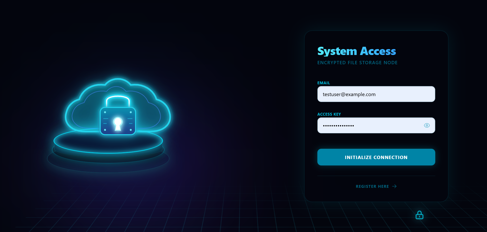
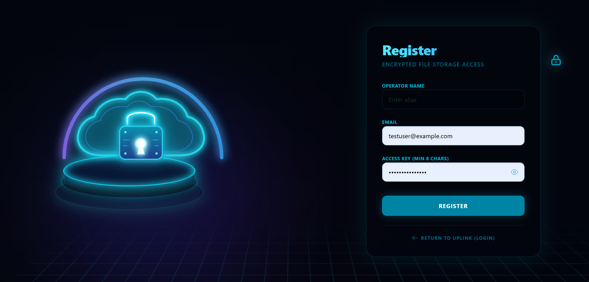
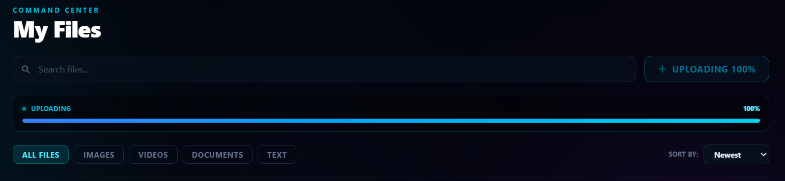
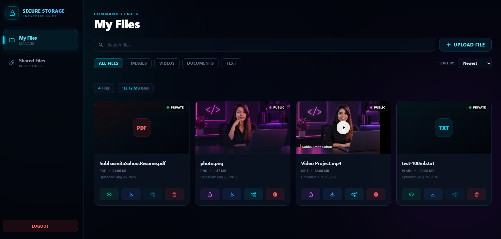
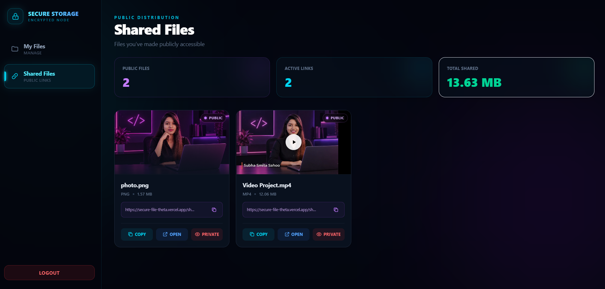

# 🔐 Secure File Storage

<p align="center">
  
  
  
  
  
  
</p>

<p align="center">
  <strong>A full-stack secure cloud file storage and sharing platform</strong>
</p>

<p align="center">
  🔐 Authentication • ☁️ AWS S3 • 🗄️ MongoDB Atlas • 🔗 Secure Sharing • 📱 Responsive UI
</p>

<p align="center">
  🌐
  <a href="https://secure-file-theta.vercel.app">
    <strong>Live Application</strong>
  </a>
  •
  💻
  <a href="https://github.com/subhasmita-puja/secure-file">
    <strong>GitHub Repository</strong>
  </a>
</p>

---

## 🌟 About the Project

**Secure File Storage** is a full-stack, cloud-backed file storage and sharing platform built for an assessment. Users can authenticate, upload, manage, preview, download, delete, and selectively share files while using **AWS S3 for cloud object storage** and **MongoDB Atlas** for metadata.

The application allows authenticated users to:

- Register and log in
- Upload files
- Manage uploaded files
- Preview supported media
- Download files
- Delete files
- Search, filter, and sort files
- Control file visibility (public/private)
- Generate and revoke public share links
- Monitor storage usage

The frontend is built with **React + Vite** and deployed on **Vercel**, while the backend is built with **Node.js + Express** and deployed on **Render**.

> 🔐 Secure storage, controlled sharing, cloud object storage, authentication, and a responsive modern interface in one full-stack application.

---

## 🌐 Live Links

| Resource | Link |
|---|---|
| 🌐 Frontend | https://secure-file-theta.vercel.app |
| 🔌 Backend API | https://secure-file-vst1.onrender.com |
| 💻 GitHub Repository | https://github.com/subhasmita-puja/secure-file |
| ❤️ Backend Health Check | https://secure-file-vst1.onrender.com/api/health |

---

## 📌 Project Overview

- 👤 User registration
- 🔐 User login
- 🎫 JWT authentication
- 🛡️ Protected file APIs
- 📤 File upload with validation
- 📄 PDF, 🖼️ PNG, 🖼️ JPG/JPEG, 📝 TXT, 🎬 MP4, 🎬 WEBM, 🎬 MOV support
- 📦 100 MB maximum upload size
- ☁️ AWS S3 object storage
- 🗄️ MongoDB Atlas metadata storage
- 🖼️ Image and 🎥 video previews
- 📥 File download and 🗑️ deletion
- 🔒 Private / 🌐 public file visibility
- 🔗 Public share links
- 🚫 Private files are not publicly shareable
- 🔍 Search, 🗂️ filtering, and ↕️ sorting
- 📊 Storage information
- 📱 Responsive UI for desktop, tablet, and mobile
- 🚀 Cloud deployment (Vercel + Render)

---

## 🖼️ Screenshots

### 🔐 Login



### 📝 Register



### 🌐 Upload Status



### 📁 My Files



### 🔗 Shared Files



---

## 🏗️ System Architecture

```text
                         USER
                           │
                           ▼
                ┌─────────────────────┐
                │    Vercel Frontend  │
                │    React + Vite     │
                └──────────┬──────────┘
                           │
                         HTTPS
                           │
                           ▼
                ┌─────────────────────┐
                │   Render Backend    │
                │ Node.js + Express   │
                │      REST API       │
                └───────┬───────┬─────┘
                        │       │
                        ▼       ▼
                ┌──────────┐ ┌─────────┐
                │ MongoDB  │ │ AWS S3  │
                │  Atlas   │ │ Storage │
                └──────────┘ └─────────┘
```

### Responsibility of each layer

**React / Vercel**
- User interface
- Authentication screens
- Dashboard
- File management
- Search / filter / sort
- Preview and sharing UI

**Node.js / Express / Render**
- Authentication
- Authorization
- File validation
- Upload / download / delete operations
- Public/private access control
- S3 integration
- API responses

**MongoDB Atlas**
- Users
- File metadata
- Ownership
- Visibility
- Share information
- Timestamps

**AWS S3**
- Actual uploaded file objects

---

## ☁️ AWS S3 — Use Case

AWS S3 is the cloud object-storage layer of this application.

Large binary files are not stored directly inside MongoDB. Instead:

```text
User selects file
      ↓
React frontend
      ↓
Express API
      ↓
Authentication + validation
      ↓
AWS S3
      ↓
File object stored
      ↓
MongoDB stores metadata
```

MongoDB stores information such as:

```text
File ID
Original filename
MIME type
File size
Owner
Visibility
Share token
Created date
Storage information
```

### Why S3?

S3 is designed for object storage and is a better fit for uploaded files than storing large binary content inside a normal application database. It provides scalable storage, strong durability, access-control capabilities, and straightforward integration with backend applications.

---

## 🔒 Private vs Public Files

### Private

A file marked **PRIVATE** remains controlled by the authenticated owner. It is **not available through the public share route** — the application does not expose a public sharing URL for a private file.

```text
PRIVATE
  |
  +-- Owner can manage it
  +-- Owner can download it
  +-- Owner can delete it
  +-- Not publicly shareable
```

### Public

When the owner intentionally changes a file to **PUBLIC**, the application generates a share token/link, e.g.:

```text
https://secure-file-theta.vercel.app/share/<share-token>
```

A recipient can open the public share page without signing into the private dashboard.

```text
PUBLIC
  |
  +-- Public share link
  +-- Public share page
  +-- Download/access according to public-share flow
```

### Revoking public access

The owner can change a file from **PUBLIC** back to **PRIVATE**, removing it from the public-sharing workflow. This makes visibility an explicit, owner-controlled decision.

---

## 🔐 Security

Security is implemented at multiple layers.

### JWT authentication

Protected API requests use:

```text
Authorization: Bearer <JWT>
```

### Authorization and ownership

Files are associated with their authenticated owner. File-management operations are performed through protected backend endpoints.

### Backend validation

The backend validates:

- File type
- File extension
- MIME type
- File size (max **100 MB**)

This is important because frontend validation alone is not a security boundary.


## 🖥️ Application Pages

### Dashboard

The dashboard acts as the command center and provides:

- Total files
- Public access count
- Private vault count
- Upload area
- File previews
- Public/private badges
- Download, share, delete
- Storage information

### My Files

The main file-management page provides:

- Search
- Upload
- Filters — All Files / Images / Videos / Documents / Text
- Sorting
- File count and storage used
- Preview, download, share, delete

### Shared Files

Dedicated public-distribution page containing:

- Public file count
- Active links
- Total shared storage
- Public file previews
- Share URLs — copy, open, make private

### Storage

The application presents storage information based on uploaded-file metadata, including:

- Storage used
- File count
- File-type distribution
- Largest files
- Public/private distribution

---

## 📱 Responsive Design

The UI is designed to work across desktop, laptop, tablet, and mobile. Responsive behavior is applied to the dashboard, sidebar/navigation, file cards, upload controls, filters, and management views so the application remains usable on different screen sizes.

---

## 📁 Project Structure

```text
secure-file/
│
├── client/
│   ├── src/
│   │   ├── api/
│   │   │   └── api.js
│   │   │
│   │   ├── assets/
│   │   │   └── hero.png
│   │   │
│   │   ├── components/
│   │   │   └── Sidebar.jsx
│   │   │
│   │   ├── pages/
│   │   │   ├── Dashboard.jsx
│   │   │   ├── Login.jsx
│   │   │   ├── MyFiles.jsx
│   │   │   ├── PublicShare.jsx
│   │   │   ├── Register.jsx
│   │   │   └── SharedFiles.jsx
│   │   │
│   │   ├── App.css
│   │   ├── App.jsx
│   │   ├── index.css
│   │   └── main.jsx
│   │
│   ├── .env
│   ├── .env.production
│   ├── .gitignore
│   ├── eslint.config.js
│   ├── index.html
│   ├── package-lock.json
│   ├── package.json
│   ├── README.md
│   └── vercel.json
│
├── server/
│   ├── src/
│   │   ├── config/
│   │   ├── controllers/
│   │   ├── middleware/
│   │   ├── models/
│   │   ├── routes/
│   │   ├── app.js
│   │   └── server.js
│   │
│   ├── package.json
│   └── .gitignore
│
└── README.md
```

---

## 🛠️ Technology Stack

| Layer | Technology | Purpose |
|---|---|---|
| Frontend | React.js | User interface |
| Build | Vite | Frontend development/build |
| Styling | Tailwind CSS | Responsive UI |
| HTTP | Axios | API communication |
| Routing | React Router | SPA/page routing |
| Backend | Node.js | Server runtime |
| API | Express.js | REST API |
| Database | MongoDB Atlas | Application metadata |
| ODM | Mongoose | MongoDB models |
| Authentication | JWT | Secure API authentication |
| Upload | Multer | Multipart file handling |
| Storage | AWS S3 | Cloud file/object storage |
| Security | CORS + validation | API access control |
| Frontend hosting | Vercel | Production frontend |
| Backend hosting | Render | Production API |

---

## 🚀 Deployment

The production system uses separate frontend and backend deployments.

- **Frontend — Vercel:** hosts the React/Vite application.
- **Backend — Render:** hosts the Node.js/Express API.
- **Database — MongoDB Atlas:** provides managed cloud database hosting.
- **Storage — AWS S3:** stores uploaded objects.

Production flow:

```text
Vercel
  ↓
Render API
  ↓
MongoDB Atlas + AWS S3
```

---

## 🧪 Local Setup

### 1. Clone

```bash
git clone https://github.com/subhasmita-puja/secure-file.git
cd secure-file
```

### 2. Backend

```bash
cd server
npm install
```

Create `server/.env`:

```env
PORT=5000
MONGO_URI=your_mongodb_connection_string
JWT_SECRET=your_jwt_secret
AWS_ACCESS_KEY_ID=your_access_key
AWS_SECRET_ACCESS_KEY=your_secret_key
AWS_REGION=your_region
AWS_S3_BUCKET_NAME=your_bucket_name
CLIENT_URL=http://localhost:5174
```

Run:

```bash
npm start
```

Health endpoint:

```text
http://localhost:5000/api/health
```

### 3. Frontend

Open another terminal:

```bash
cd client
npm install
```

Create `client/.env`:

```env
VITE_API_URL=http://localhost:5000/api
```

Run:

```bash
npm run dev
```

---

## 🌍 Production Configuration

The deployed frontend uses:

```env
VITE_API_URL=https://secure-file-vst1.onrender.com/api
```

The backend allows the deployed frontend through:

```env
CLIENT_URL=https://secure-file-theta.vercel.app
```

Do not put production secrets into GitHub.

---

## 🔄 File Lifecycle

```text
Register/Login
     ↓
JWT authentication
     ↓
Select file
     ↓
Frontend validation
     ↓
Backend authentication
     ↓
Backend file validation
     ↓
Upload to AWS S3
     ↓
Save metadata in MongoDB
     ↓
File appears in dashboard
     ↓
Preview / Download / Delete
     ↓
Optional: Make Public
     ↓
Generate/use share token
     ↓
Public share page
     ↓
Optional: Make Private again
```

---


## 👩‍💻 Author

**Subhasmita Sahoo**

- GitHub: https://github.com/subhasmita-puja
- Repository: https://github.com/subhasmita-puja/secure-file

---
